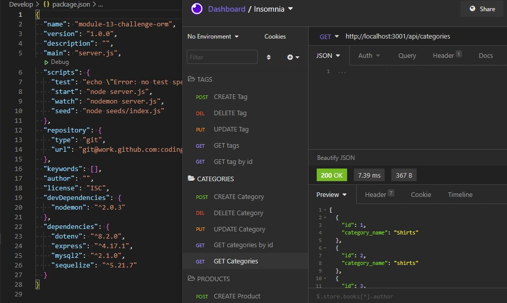

# E-Commerce-Back-End-ORM

### Designer Name
* Jonah Haase

# Table of Contents
1. [Project Description](#project-description)
2. [Links](#link)
3. [Mockup Image](#mockup-image)
4. [Project Installation](#project-installation)
5. [Instructions](#instructions-on-how-to-use-this-application)
6. [Tests](#tests)
7. [Contributions](#contributions)
8. [License](#license)
9. [Questions & Contact Info](#questions)

## Project Description
* Internet retail, also known as e-commerce, is the largest sector of the electronics industry, generating an estimated $29 trillion in 2019. E-commerce platforms like Shopify and WooCommerce provide a suite of services to businesses of all sizes. Due to their prevalence, understanding the fundamental architecture of these platforms will benefit you as a full-stack web developer.

## Link
GitHub Repository: https://github.com/jojonah1812/E-Commerce-Back-End-ORM br>
Video: https://drive.google.com/file/d/1L-9Su_MJBp1Rv4-mlnYhvqZzr6uS1RyR/view

## Mockup Image
The following image shows the application's package.json and it in use using Insomnia:

## Project Installation
* Install the following NPMs: sequelize, mysql2, express, dotenv, nodemon.  It is recomendaed to use a platform such as MySQL to manage the database, and Postman or Insomnia to test your updates.

## Instructions on how to use this application
* This project will allow you to manage the back-end of an e-commerce site that will service the needs of the business: items carried, inventory management, and updating the the current items carried.

## Tests
* N

## Contributions
* true

## License
* Open

## Questions
If you have any questions, please feel free to contact me through my GitHub account or my email address.
* #### GitHub Username    jojonah1812
* #### GitHub Link    https://github.com/jojonah1812
* #### Email    jojonah@gmail.com

